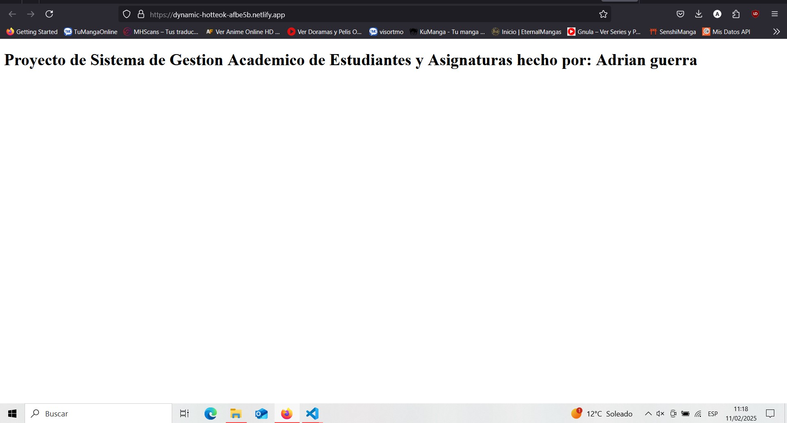
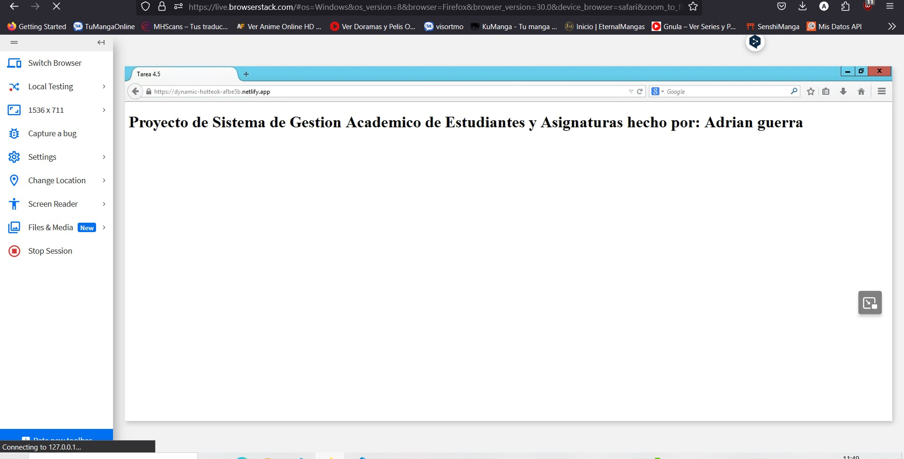
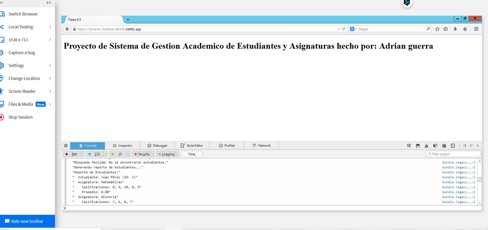
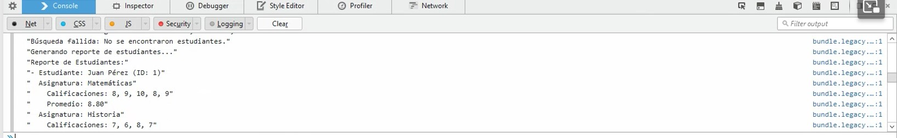

# Tarea 4.5 - Polyfill y Transpile
> ---
> ## Enunciado
> Install and configure node, webpack and babel to polyfill and transpile your code so it runs in older browsers. 
>
> ---

## Documentación
En este apartado voy a documentar los pasos que he seguido para implementar **Polyfill** y **Transpile** en el proyecto:

# Configuración de Webpack con Soporte para Modern y Legacy Builds

Este proyecto utiliza Webpack para gestionar la compilación de código moderno y legacy, permitiendo compatibilidad con distintos navegadores.


---

## 🚀 Instalación y Configuración

### 1️⃣ Instalar Dependencias

Asegúrate de tener [Node.js](https://nodejs.org/) instalado. Luego, en la raíz del proyecto, ejecuta:

```sh
npm install
```

Esto instalará todas las dependencias necesarias.

### 2️⃣ Configuración de Webpack

Webpack se divide en varios archivos para modularidad:

- **webpack.common.js** → Configuración común (entrada, salida, plugins).
- **webpack.modern.js** → Configuración para navegadores modernos.
- **webpack.legacy.js** → Configuración para navegadores antiguos.
- **webpack.config.js** → Importa `modern` y `legacy` y los combina.

#### 📌 webpack.common.js (Configuración Compartida)

```js
import CopyWebpackPlugin from 'copy-webpack-plugin';
import path from 'path';

export default {   
    entry: './src/script.js',
    output: {
        path: path.resolve(process.cwd(), 'compilado', process.env.modo),
        filename: 'bundle.js',
    },
    mode: process.env.modo,
    plugins: [
        new CopyWebpackPlugin({
            patterns: [
                { from: './src/index.html', to: '.' },
            ],
        }),
    ],
};
```

#### 📌 webpack.modern.js (Configuración para Navegadores Modernos)

```js
import path from 'path';
import { merge } from 'webpack-merge';
import common from './webpack.common.js';

export default merge(common, {
    output: {
        filename: 'bundle.modern.js',
    },
    module: {
        rules:  [
            {
                test: /\.js$/,
                exclude: /node_modules/,
                use: {
                    loader: 'babel-loader',
                }
            },
        ],
    },
});
```

#### 📌 webpack.legacy.js (Configuración para Navegadores Antiguos)

```js
import path from 'path';
import { merge } from 'webpack-merge';
import common from './webpack.common.js';

export default merge(common, {
    output: {
        filename: 'bundle.legacy.js',
    },
    module: {
        rules:  [
            {
                test: /\.js$/,
                exclude: /node_modules/,
                use: {
                    loader: 'babel-loader',
                }
            },
        ],
    },
});
```

#### 📌 webpack.config.js (Combinación de Modern y Legacy)

```js
import legacyConfig from './webpack.legacy.js';
import modernConfig from './webpack.modern.js';

export default [legacyConfig, modernConfig];
```

---

## ⚡ Uso


## Scripts del Proyecto

Este archivo describe los diferentes scripts definidos en el proyecto, utilizados para generar documentación, limpiar directorios, y construir el proyecto en diferentes configuraciones de Webpack.

## Scripts

### `doc`
## Scripts de NPM

Este proyecto utiliza una serie de scripts de NPM para facilitar la generación de documentación, la compilación del código y la creación de los bundles. A continuación, se explican los scripts disponibles:

### 📚 Generación de documentación con JSDoc

- **`doc`**: Ejecuta JSDoc utilizando la configuración definida en `jsdoc.json`.
  ```sh
  npm run doc
  ```
- **`limpia:doc`**: Elimina la carpeta `docs` donde se genera la documentación.
  ```sh
  npm run limpia:doc
  ```
- **`generar:jsdoc`**: Ejecuta `limpia:doc` y luego `doc` para regenerar la documentación desde cero.
  ```sh
  npm run generar:jsdoc
  ```

### ⚙️ Compilación con Webpack

- **`antiguo`**: Compila el código utilizando la configuración `webpack.legacy.js`. La variable `modo` debe estar definida (por defecto: `development` o `production`).
  ```sh
  npm run antiguo
  ```
- **`moderno`**: Compila el código utilizando la configuración `webpack.modern.js`.
  ```sh
  npm run moderno
  ```
- **`des`**: Compila ambas versiones (`antiguo` y `moderno`) en modo `development`.
  ```sh
  npm run des
  ```
- **`prod`**: Compila ambas versiones en modo `production`.
  ```sh
  npm run prod
  ```

### 🔧 Limpieza y generación de bundles

- **`limpia-com`**: Elimina la carpeta `compilado` donde se guardan los archivos generados.
  ```sh
  npm run limpia-com
  ```
- **`generar-bundle`**: Ejecuta `limpia-com`, luego `des` y `prod` para limpiar y generar los bundles tanto en modo desarrollo como en producción.
  ```sh
  npm run generar-bundle

  
  ```


## Scripts de NPM

Este proyecto utiliza una serie de scripts de NPM para facilitar la generación de documentación, la compilación del código y la creación de los bundles. A continuación, se explican los scripts disponibles:

### 📚 Generación de documentación con JSDoc

- **`doc`**: Ejecuta JSDoc utilizando la configuración definida en `jsdoc.json`.
  ```sh
  npm run doc
  ```
- **`limpia:doc`**: Elimina la carpeta `docs` donde se genera la documentación.
  ```sh
  npm run limpia:doc
  ```
- **`generar:jsdoc`**: Ejecuta `limpia:doc` y luego `doc` para regenerar la documentación desde cero.
  ```sh
  npm run generar:jsdoc
  ```

### ⚙️ Compilación con Webpack

- **`antiguo`**: Compila el código utilizando la configuración `webpack.legacy.js`. La variable `modo` debe estar definida (por defecto: `development` o `production`).
  ```sh
  npm run antiguo
  ```
- **`moderno`**: Compila el código utilizando la configuración `webpack.modern.js`.
  ```sh
  npm run moderno
  ```
- **`des`**: Compila ambas versiones (`antiguo` y `moderno`) en modo `development`.
  ```sh
  npm run des
  ```
- **`prod`**: Compila ambas versiones en modo `production`.
  ```sh
  npm run prod
  ```

### 🔧 Limpieza y generación de bundles

- **`limpia-com`**: Elimina la carpeta `compilado` donde se guardan los archivos generados.
  ```sh
  npm run limpia-com
  ```
- **`generar-bundle`**: Ejecuta `limpia-com`, luego `des` y `prod` para limpiar y generar los bundles tanto en modo desarrollo como en producción.
  ```sh
  npm run generar-bundle
  ```

## Vista en Producción y Navegadores Antiguos

### 🌍 Vista en Producción

Así es como se ve la página en su versión optimizada para producción:



### 🏛️ Vista en Navegadores Antiguos

Si se accede a la página desde un navegador antiguo en este caso firefox version 30, se mostrará una versión compatible con tecnologías más antiguas:






